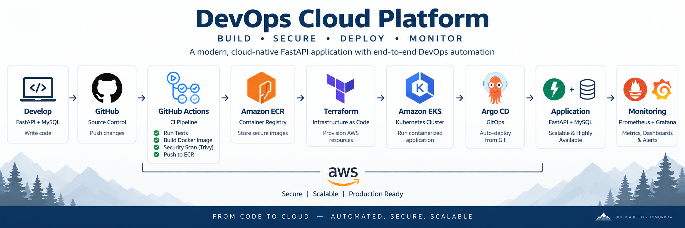
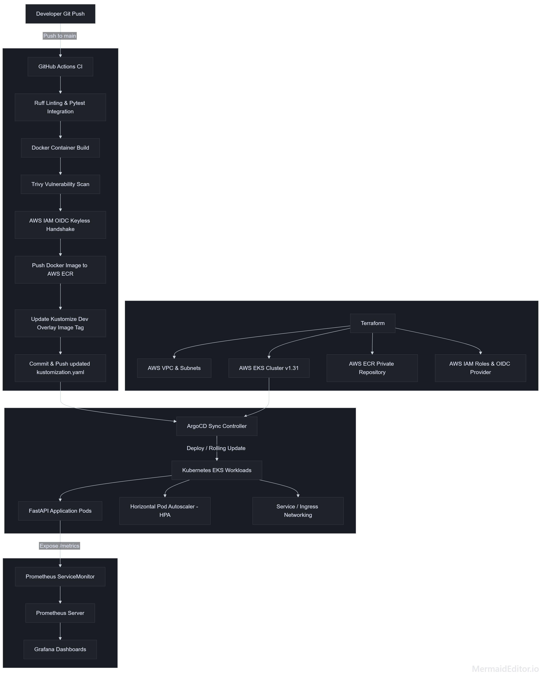
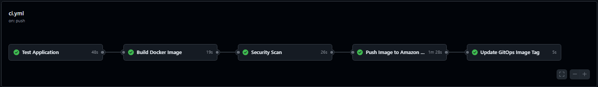
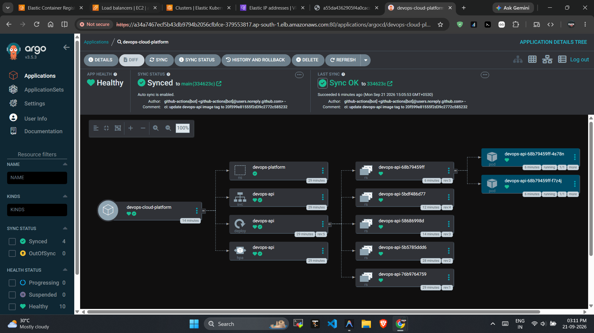
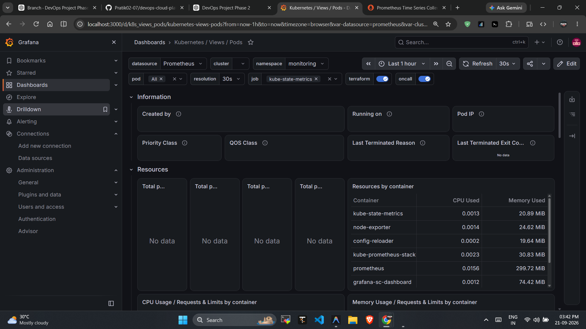
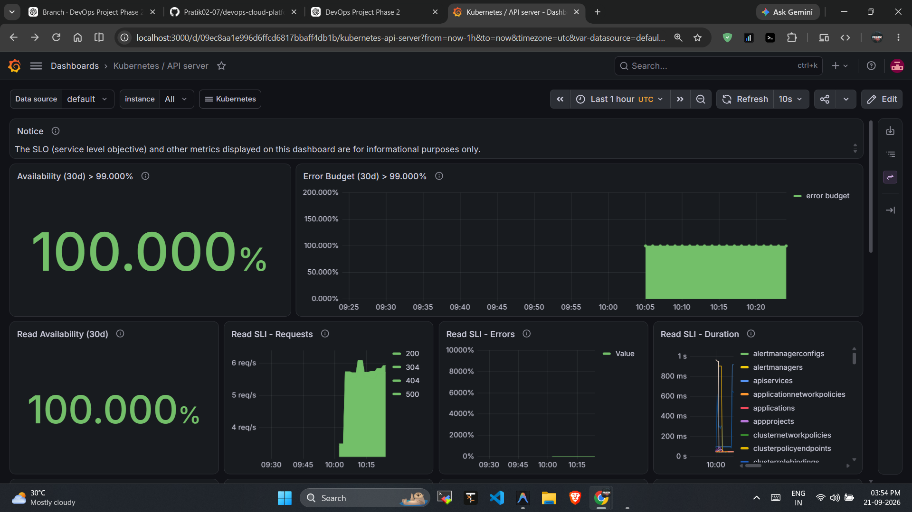

<div align="center">

# 🚀 DevOps Cloud Platform

[](https://github.com/Pratik02-07/devops-cloud-platform/actions/workflows/ci.yml)


An enterprise-grade, cloud-native RESTful task management microservice built with **Python FastAPI** and **PostgreSQL**, deployed on **AWS EKS** using **Terraform (IaC)**, **GitOps (ArgoCD & Kustomize)**, **GitHub Actions (OIDC + Trivy)**, and monitored via **Prometheus & Grafana**.

<br />



</div>

---

## 📋 Table of Contents

- [Overview](#-overview)
- [Architecture & Workflow](#-architecture--workflow)
- [Key Features](#-key-features)
- [Tech Stack](#-tech-stack)
- [Visual Showcase & Screenshots](#-visual-showcase--screenshots)
- [Repository Structure](#-repository-structure)
- [API Endpoints & Usage](#-api-endpoints--usage)
- [Local Development Setup](#-local-development-setup)
- [Infrastructure Provisioning (Terraform)](#-infrastructure-provisioning-terraform)
- [Continuous Integration & Security (GitHub Actions)](#-continuous-integration--security-github-actions)
- [GitOps Continuous Delivery (ArgoCD)](#-gitops-continuous-delivery-argocd)
- [Observability & Monitoring](#-observability--monitoring)
- [Security & Compliance](#-security--compliance)
- [License](#-license)

---

## 🌟 Overview

The **DevOps Cloud Platform** is an end-to-end, production-ready DevOps demonstration project showcasing modern cloud engineering, Infrastructure as Code, GitOps continuous delivery, zero-trust security authentication, and comprehensive observability.

The platform exposes an asynchronous task management API microservice backed by PostgreSQL/MySQL database persistence, containerized with Docker, automated with GitHub Actions, deployed to AWS EKS via ArgoCD, and monitored using Prometheus Operator and Grafana.

---

## 🏗️ Architecture & Workflow




---

## ⚡ Key Features

- **Cloud-Native REST API**: Built with Python 3.11, FastAPI, SQLAlchemy ORM, and Pydantic v2 schemas.
- **Infrastructure as Code (IaC)**: Fully automated AWS infrastructure (VPC across multiple AZs, EKS 1.31, ECR, IAM) provisioned using modular Terraform.
- **Keyless AWS Authentication (OIDC)**: Passwordless authentication between GitHub Actions and AWS ECR using OpenID Connect identity federation (zero static access keys stored).
- **Shift-Left Security Scanning**: Automated vulnerability checks using **Trivy** in the CI pipeline, automatically blocking builds with `HIGH` or `CRITICAL` defects.
- **GitOps Continuous Deployment**: Declarative continuous delivery using **ArgoCD** and **Kustomize** (`base` and `dev` overlays) with automatic deployment sync and version-controlled rollbacks.
- **High Availability & Autoscaling**: Kubernetes Horizontal Pod Autoscaler (HPA) and Liveness/Readiness health probes for zero-downtime operations.
- **Full-Stack Observability**: Application runtime metric exporter (`prometheus-fastapi-instrumentator`), Kubernetes `ServiceMonitor` integration, and custom Grafana dashboards.

---

## 🛠️ Tech Stack

| Domain | Technology | Purpose |
| :--- | :--- | :--- |
| **Backend Framework** | [FastAPI](https://fastapi.tiangolo.com/) + Python 3.11 | High-performance asynchronous REST API framework |
| **Database & ORM** | [SQLAlchemy](https://www.sqlalchemy.org/) & Pydantic v2 | Database ORM, serialization, and data validation |
| **Containerization** | [Docker](https://www.docker.com/) | Multi-stage image build (`python:3.11-slim`) |
| **Infrastructure (IaC)** | [Terraform](https://www.terraform.io/) (~> 5.0) | AWS VPC, EKS cluster, ECR, and IAM role provisioning |
| **Cloud Hosting** | [AWS](https://aws.amazon.com/) (EKS, ECR, VPC, IAM) | Managed Kubernetes and cloud hosting (`ap-south-1`) |
| **GitOps Delivery** | [ArgoCD](https://argo-cd.readthedocs.io/) & Kustomize | Declarative GitOps deployment sync and environment overlays |
| **CI/CD Automation** | [GitHub Actions](https://github.com/features/actions) | Automated linting, testing, scanning, ECR push, and Git updates |
| **Security Scanning** | [Trivy](https://trivy.dev/) | OS and library vulnerability scanning |
| **Observability** | [Prometheus](https://prometheus.io/) & [Grafana](https://grafana.com/) | Metric scraping (`ServiceMonitor`) and real-time dashboard visualization |

---

## 📷 Visual Showcase & Screenshots

### 1. Automated CI/CD Pipeline (GitHub Actions)
Fully automated linting, Pytest integration testing, Docker compilation, Trivy vulnerability scanning, AWS OIDC authentication, ECR publishing, and GitOps manifest updating.



---

### 2. GitOps Continuous Delivery (ArgoCD)
ArgoCD continuously monitors `k8s/overlays/dev/` and automatically synchronizes cluster deployments upon new Git commits with zero downtime.



---

### 3. Observability & Monitoring (Grafana & Prometheus)
Real-time dashboard visualization tracking application request throughput, HTTP response codes, request duration latency (p95/p99), CPU/RAM usage, and active pod replicas.





---

## 📁 Repository Structure

```
devops-cloud-platform/
├── .github/
│   └── workflows/
│       └── ci.yml             # Main CI/CD pipeline (Lint -> Test -> Scan -> ECR Push -> GitOps)
├── app/                       # FastAPI Source Code
│   ├── routes/
│   │   └── tasks.py           # REST CRUD endpoints
│   ├── database.py            # SQLAlchemy database engine setup
│   ├── main.py                # FastAPI entrypoint, health checks, & Prometheus instrumentation
│   ├── models.py              # Database ORM models
│   └── schemas.py             # Pydantic data schemas
├── argocd/                    # GitOps Delivery Config
│   └── application.yaml       # ArgoCD Application CRD manifest
├── Docs/                      # Visual documentation & screenshots
├── k8s/                       # Kubernetes Manifests (Kustomize)
│   ├── base/                  # Shared Kubernetes manifests (Deployment, Service, HPA, ServiceMonitor)
│   └── overlays/
│       └── dev/               # Development environment overlay
├── terraform/                 # AWS Infrastructure as Code (IaC)
│   ├── vpc.tf                 # Multi-AZ VPC & Networking
│   ├── eks.tf                 # Amazon EKS cluster & managed node group
│   ├── ecr.tf                 # Private AWS ECR repository
│   ├── iam.tf                 # AWS IAM roles & OIDC provider
│   ├── locals.tf              # Shared tagging & naming standards
│   ├── outputs.tf             # Key terraform outputs
│   └── variables.tf           # Input parameters
├── tests/                     # Test Suite
│   └── test_tasks.py          # Pytest task API integration tests
├── Dockerfile                 # Multi-stage production Docker build
├── docker-compose.yml         # Local development environment
├── pyproject.toml             # Ruff & tool configuration
├── requirements.txt           # Production dependencies
└── requirements-dev.txt       # Development & testing dependencies
```

---

## 🔌 API Endpoints & Usage

| Method | Endpoint | Description | Sample Request Payload / Parameters |
| :--- | :--- | :--- | :--- |
| `GET` | `/health` | Health check endpoint | None |
| `GET` | `/metrics` | Prometheus metrics endpoint | None |
| `POST` | `/api/tasks/` | Create a new task | `{ "title": "Setup EKS", "description": "Deploy cluster", "completed": false }` |
| `GET` | `/api/tasks/` | Retrieve all tasks | None |
| `GET` | `/api/tasks/{id}` | Retrieve specific task | Path parameter `id` (integer) |
| `DELETE` | `/api/tasks/{id}` | Delete task by ID | Path parameter `id` (integer) |

### Sample Request & Response

#### Create Task (`POST /api/tasks/`)
```bash
curl -X POST "http://localhost:8000/api/tasks/" \
     -H "Content-Type: application/json" \
     -d '{"title": "Deploy to EKS", "description": "Configure ArgoCD", "completed": false}'
```

**Response (`200 OK`)**:
```json
{
  "id": 1,
  "title": "Deploy to EKS",
  "description": "Configure ArgoCD",
  "completed": false
}
```

---

## 💻 Local Development Setup

### Option 1: Docker Compose (Recommended)
Launch the FastAPI application and PostgreSQL database with a single command:

```bash
docker-compose up --build
```
Access the application at `http://localhost:8000` and view interactive API docs at `http://localhost:8000/docs`.

### Option 2: Python Virtual Environment

1. Create and activate a Python virtual environment:
   ```bash
   python3 -m venv venv
   source venv/bin/activate  # On Windows: venv\Scripts\activate
   ```

2. Install dependencies:
   ```bash
   pip install -r requirements-dev.txt
   ```

3. Run static code checks and tests:
   ```bash
   ruff check .
   pytest -v
   ```

4. Start the application locally:
   ```bash
   uvicorn app.main:app --reload
   ```

---

## 🚀 Infrastructure Provisioning (Terraform)

Provision the complete AWS cloud architecture using Terraform:

```bash
cd terraform

# Initialize Terraform modules and providers
terraform init

# Preview resource changes
terraform plan

# Apply infrastructure provisioning to AWS
terraform apply -auto-approve
```

---

## 🔁 Continuous Integration & Security (GitHub Actions)

The CI workflow `.github/workflows/ci.yml` triggers on every push and pull request to `main` and `develop`:

1. **Test Job**: Runs `ruff check .` and `pytest` against a live MySQL container service.
2. **Build Job**: Verifies Docker container compilation and framework imports.
3. **Security Scan**: Executes **Trivy** scanner to enforce zero `HIGH` or `CRITICAL` vulnerability policies.
4. **Push to ECR**: Authenticates to AWS via keyless **OIDC**, tags image with `github.sha`, and pushes to AWS ECR.
5. **Update GitOps**: Updates `k8s/overlays/dev/kustomization.yaml` with the new image tag and pushes the commit back to GitHub.

---

## ⛵ GitOps Continuous Delivery (ArgoCD)

Deploy ArgoCD Application CRD to begin automated GitOps reconciliation:

```bash
kubectl apply -f argocd/application.yaml
```

ArgoCD automatically detects image tag changes committed to `k8s/overlays/dev/kustomization.yaml` by GitHub Actions and performs zero-downtime rolling updates on EKS.

---

## 📊 Observability & Monitoring

The application automatically exposes Prometheus metrics via `prometheus-fastapi-instrumentator` at `/metrics`.

When deployed to EKS:
1. Kubernetes `ServiceMonitor` (`k8s/base/servicemonitor.yaml`) targets app pods on port `8000`.
2. Prometheus Operator collects metrics automatically.
3. Import custom dashboards into Grafana to monitor latency (p95/p99), HTTP throughput, error rates, and pod resource utilization.

---

## 🛡️ Security & Compliance

- **Keyless AWS Authentication**: Uses OpenID Connect (OIDC) identity federation instead of long-lived static AWS access keys.
- **Container Vulnerability Scanning**: Integrated Trivy scanner blocks vulnerable container builds in CI.
- **Least Privilege Access**: IAM roles follow strict minimal permission principles.
- **Subnet Isolation**: EKS nodes and databases run in private subnets; public internet access is managed via NAT/Internet Gateways.
- **Non-Root Execution**: Docker container runs under non-root execution contexts.

---

## 📜 License

Distributed under the MIT License. See `LICENSE` for more information.